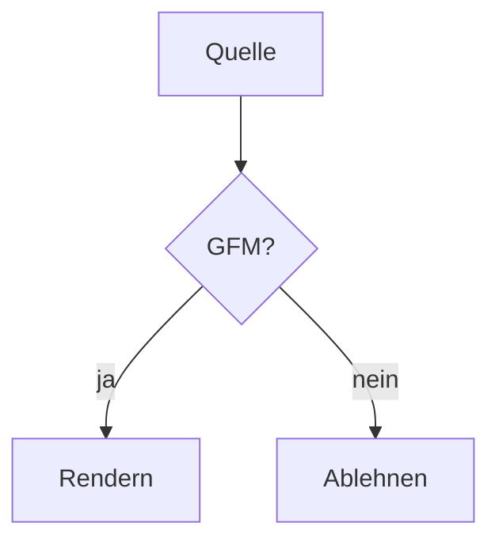

# Der Torture-Test für `mat`

Ein Absatz mit **fett**, *kursiv*, ~~zwei Tilden~~ und ~einer Tilde~, `inline code`
sowie einem [internen Link](#c-vs-net--ünïcode) und einem [externen](https://example.com).

Autolinks: https://example.com, www.example.com, kontakt@example.com — und foo.com,
das GitHub bewusst **nicht** verlinkt.

## Tabelle mit Ausrichtungen

| Links | Mitte | Rechts |
|:------|:-----:|-------:|
| a     |   b   |      c |
| lang  | text  |   1234 |

## Listen

- Erste Ebene
  - Zweite Ebene
    - Dritte Ebene
- Zurück auf eins

1. Nummeriert
2. Weiter
   1. Verschachtelt

- [x] Erledigt
- [ ] Offen

## Alerts

> [!NOTE]
> Nützlicher Hinweis.

> [!TIP]
> Hilfreicher Tipp.

> [!IMPORTANT]
> Entscheidende Information.

> [!WARNING]
> Achtung, Risiko.

> [!CAUTION]
> Gefährliche Folgen.

> Ein gewöhnliches Zitat, das **kein** Alert ist.

## C# vs .NET — Ünïcode!!

Eine Überschrift mit Umlauten und Interpunktion, auf die oben verlinkt wird.

## Code

```ts
export function greet(name: string): string {
  return `Hallo, ${name}`;
}
```

```haskell
main :: IO ()
main = putStrLn "Hallo"
```

```toml
[package]
name = "mat"
```

```
Kein Sprach-Tag.
```

## Diagramm



## Mathe

Inline $E = mc^2$, GitHubs Backtick-Variante $`a_1 + a_2`$ und einzeiliges $$x^2$$.

```math
\frac{-b \pm \sqrt{b^2 - 4ac}}{2a}
```

$$
\sum_{i=1}^{n} i = \frac{n(n+1)}{2}
$$

## Rohes HTML

<details>
<summary>Aufklappbarer Abschnitt mit <em>Inline-Markup</em></summary>

Inhalt mit einem [Link](https://example.com) und einer Liste:

- eins
- zwei

</details>

<script>alert('xss')</script>

<iframe src="https://example.com"></iframe>


## Bilder


## Fußnoten

Ein Satz mit Fußnote[^eins] und noch einer[^zwei].

[^eins]: Die erste Anmerkung.
[^zwei]: Die zweite Anmerkung, mit `Code`.

---

Ende.
